```{r setup, include=FALSE}
knitr::opts_chunk$set(echo = FALSE)
```
# 1.Critique of Visualisation

A makeover of a data visualisation created from data provided by Department of Statistics, Singapore (DOS).

### The current data visualisation 

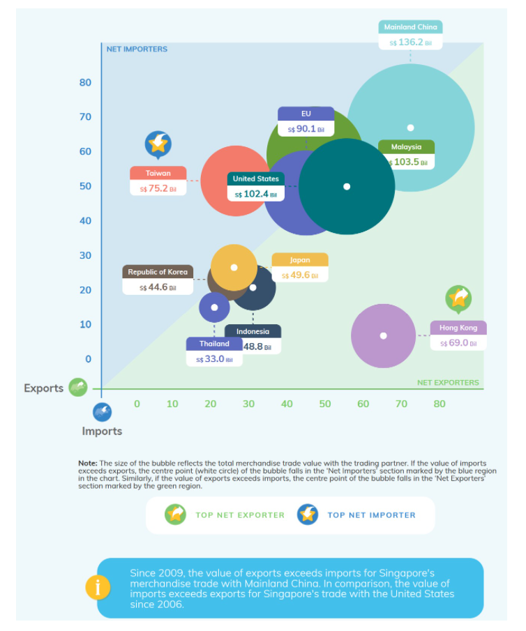 

The current data visualisation above can be found in this [**link**](https://www.singstat.gov.sg/modules/infographics/singapore-international-trade). The data is available under the sub-section of [**Merchandise Trade by Region/Market**](https://www.singstat.gov.sg/find-data/search-by-theme/trade-and-investment/merchandise-trade/latest-data).


### 1.1 Clarity

S/N	| Critiques	| Suggestions
-| ------------------ | ---------
1	|<br>The top net exporter and top net importer icons within the graph looked too similar to the country bubbles and can create confusion that they are separate countries at first glance.<br>   <br>|Use tooltip to indicate the top net exporter and top net importer country respectively. 
2	|<br>There are too many colours used that impairs the reader’s pre-attentive processing. <br> <br>The colours in the graph were also inappropriately used, affecting the clarity of the data visualization. For instance, the graph differentiated the export and import categories with green and blue respectively but also used green to represent some countries such as Malaysia and the United States. Readers might misinterpret that those countries in green bubbles are net exporters. <br> <br>Furthermore, while the current data visualization might have intended to use different colours to differentiate the countries, this was also not consistently applied as both Thailand and EU were represented by purple bubbles.<br>   <br>|The colors should be used to serve a particular communication goal.<br> <br>Use blue and red to represent whether the countries are net exporters or net importers.The color intensity can differ based on the balance of trade value.<br> <br>The opacity of the colors can be reduced so that readers can still see different country bubbles even if they overlap. 
3	|<br>Missing x-axis and y-axis for the data visualization. Without the x-axis and y-axis labels, readers cannot ascertain if they are percentile values or actual values. The units of the numbers in the axis were also missing so it is unclear whether they are represented in millions or billions or some other scale.<br>   <br>| Include the x-axis and y-axis for the data visualization.
4	|It is hard to read the white font against the light blue information bar as the colours are not contrasting enough.|<br>Use dark fonts against a white or light background to maximise contrast and improve readability.<br>   <br>


### 1.2 Aesthetics
S/N	| Critiques	| Suggestions
-| ------------------ | ---------
1	|<br>Data-ink is not appropriately used. For instance, the data-ink is used for the lines on the axis and not emphasizing on the values of the axis.<br>   <br>| To remove unnecessary non data-ink and emphasize the remaining data-ink.
2|<br>The current data visualization's scatterplot bubbles are all clumped together, affecting the readability of the data visualization.<br>   <br>|<br>Use percentile instead of absolute values to plot the countries on the import vs export axis. This will allow the scatterplot to be more spread out and improve aesthetics and readability of the visualization.<br>   <br>
3|<br>To quote Leonarda Da Vinci, “Simplicity is the ultimate sophistication”.<br> <br>The data visualization, though colourful, is not visually aesthetic as it is overcrowded with too many visual information such as a background with two separate colours; multiple colours to represent different countries; white arrows to explain the concept of export vs import and white centre point in the bubbles to facilitate readers’ interpretation of whether the countries fall within the net importer or net exporter section.<br>   <br>|With the interactivity of charts, include tooltips to convey all those additional key information and even embed charts to further drill down on some information.<br> <br>Have a single background color for the main data visualization chart(s).


# 2.Proposed Design
### 2.1 Sketch

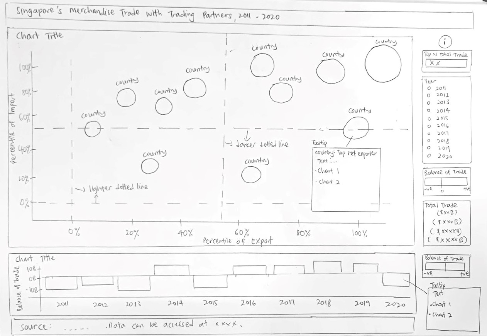 
 
### 2.2 Advantages of proposed design  
* **Uncluttered data visualization charts** –additional information are included in the tooltips and readers can view them when they hover over the countries in the scatterplot or the bars in the bar chart.  
* **Information bar section** – the information within the tooltip of the information icon uses dark font against a white background for more contrast and improved readability.  
* **Data ink is used appropriately**. For instance, the 0% reference line uses a lighter color and the 50% reference line uses a darker color to emphasize on the latter.  
* There is a **“Top N total trade” parameter** that allows more customization to readers' needs as they can input their desired number of top trading partners.  
* **Colors were used to represent a clear communication goal**. In this proposed design, it is to differentiate the net exporters (positive balance of trade) and net importers (negative balance of trade) with the colors blue and red respectively. For the scatterplot, the full color range is used on a red-blue diverging continuum to represent the different values of the balance of trade ( a strong hue will represent that the country ranks higher as a net importer or net exporter relative to its fellow net importers or net exporters respectively).   


# 3.Step-By-Step Preparation


No	| Step	| Action
--| ---------------------------------- | ----------------
1	|Load the outputFile excel file into Tableau Desktop after renaming ‘T1’ and ‘T2’ to ‘Import and ‘Export’ respectively. <br> <br> Drag the ‘Import’ and ‘Export’ worksheets from the left pane to the canvas.|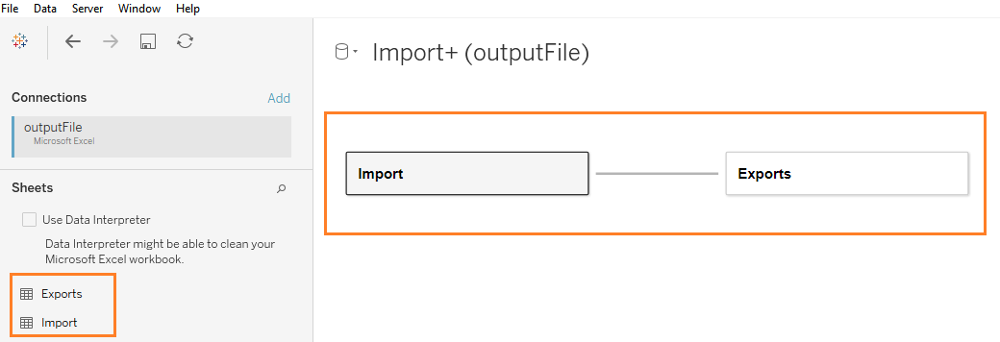{width=300%}<br> <br>
2	|Create a relationship connection by connecting import variables with export variables.|.PNG){width=300%}<br> <br> 	 
3	|Select all the columns outside the desired period of Jan 2011 – Dec 2020 and hide those columns.|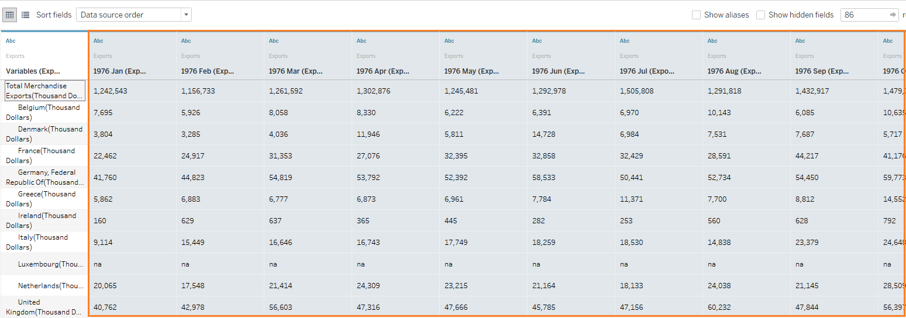{width=300%}  	 
4	|Pivot the columns of 2011 Jan – 2020 Dec.|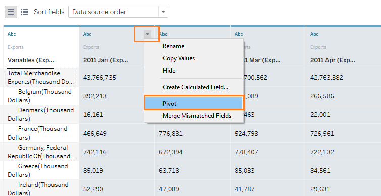{width=300%}<br> <br> 	 
5	|Change the variable type for the date column from ‘String’ to ‘Date’ and rename the column to Date.|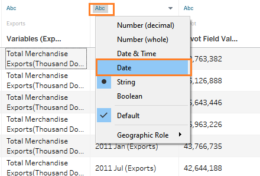{width=250%}<br> <br> 	
6	|Change the variable type for the date column from ‘String’ to ‘Number (whole)’.|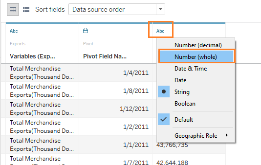{width=250%}<br> <br>	
7	|Create a calculated field for export value. The export value will be ‘Pivot Field Values’ multiplied by 1000 in order as ‘Pivot Field Values’ are currently in units of thousands.|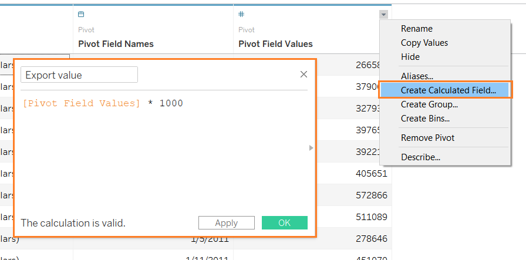{width=250%}<br> <br>  	 
8	|Create a column for the trading partner’s name without ‘(Thousand Dollars)’ by clicking on ‘Split’.|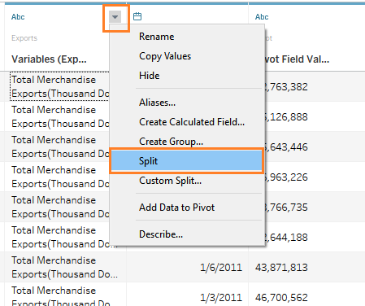{width=250%} 	 
9	|Hide the ‘Variables (Exports)’ and ‘Pivot Field Values’ Columns. Rename all the other column names as shown in the image.<br> <br>Repeat steps 1-9 after clicking on the ‘Imports’ logical table in the canvas. |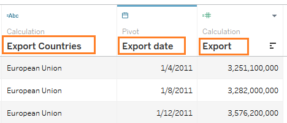{width=250%}<br> <br>
10 |Add the date field (import date = export date) in the relationship link at the canvas section.|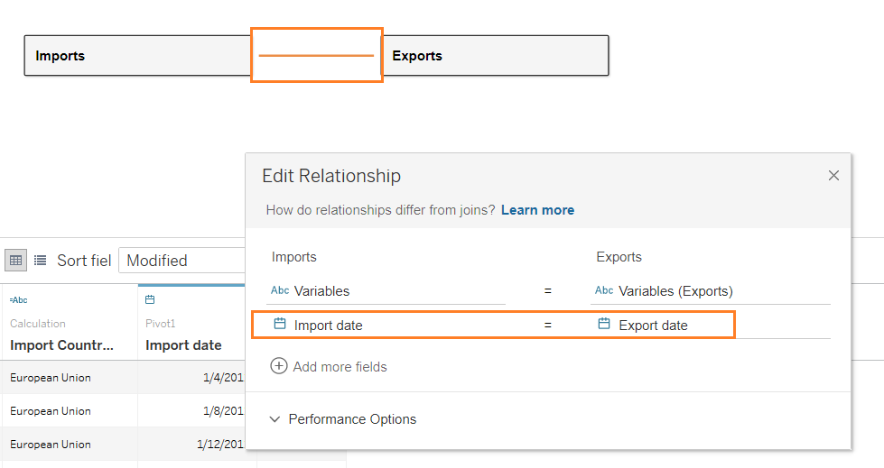{width=250%}<br> <br> 	 
11 |For Chart 1, create a new worksheet and name it Merchandise Trade Value. <br> <br>Drag ‘Sum Export’ to the column shelf and ‘Sum Imports’ to the row shelf. Add import and export countries to the Marks card.<br> <br>Select ‘Edit table calculation’ and change calculation type to percentile, computing using specific dimensions of both ‘Export countries’ and ‘Import countries’. |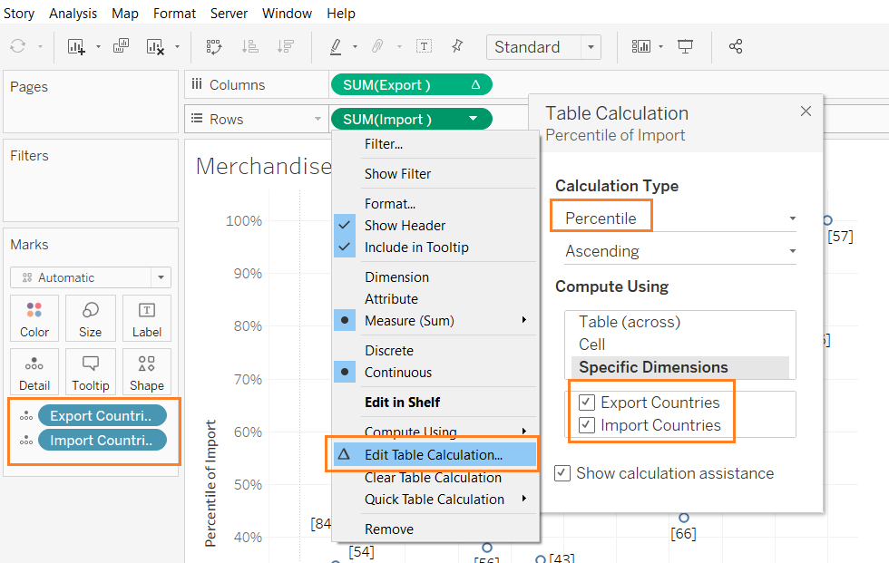{width=250%}<br> <br>
12 |Under ‘Analysis’, select ‘Create Calculated Field’ to create a new variable called ‘Total Trade’.|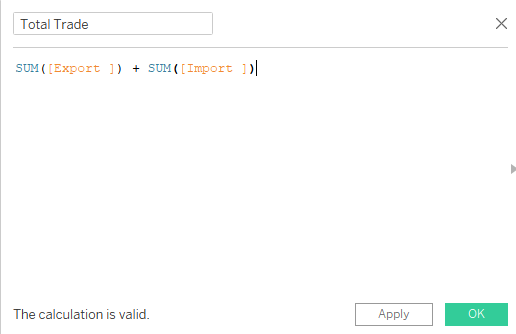{width=250%} 
13 |Drag ‘Total Trade’ to the size segment in the Marks card.|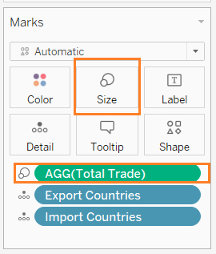{width=250%}<br> <br>
14 |Under ‘Analysis’, select ‘Create Calculated Field’ to create a new variable called ‘Balance of Trade’.|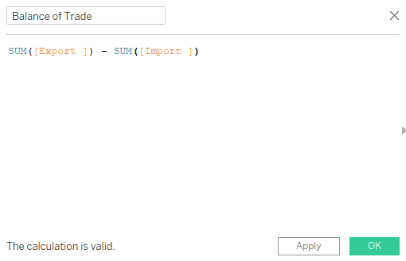{width=250%} 
15 |Drag ‘Balance of Trade’ to the color segment in the Marks card. Select red-blue diverging palette with full color range and center at 0.|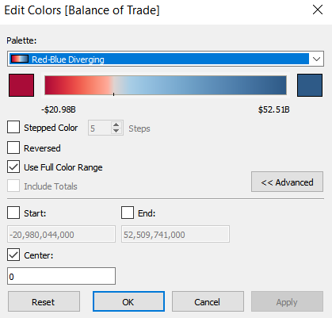{width=250%}<br> <br> 
16 |Drag ‘Balance of Trade’, ‘Total Trade’, ‘Export’, ‘Import’ variables onto the detail segment in the Marks card.|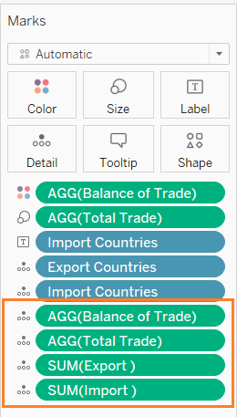{width=250%}<br> <br> 	 
17 |Under ‘Analysis’, select ‘Create Calculated Field’ to create a new variable called ‘Net Exporter’.|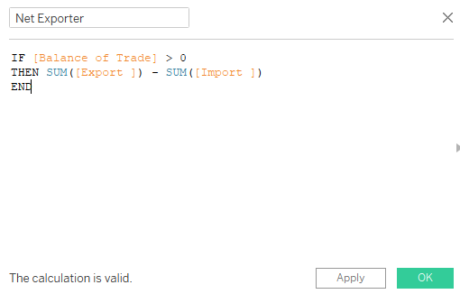{width=250%}<br> <br>  
18 |Under ‘Analysis’, select ‘Create Calculated Field’ to create a new variable called ‘Net Importer’.|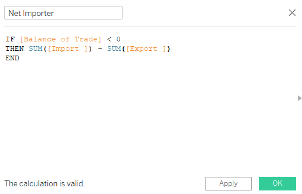{width=250%}<br> <br> 
19 |Under ‘Analysis’, select ‘Create Calculated Field’ to create a new variable called ‘Rank Net Exporter’.|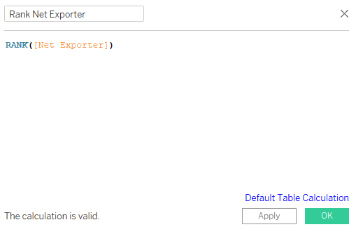{width=250%}<br> <br>  
20 |Under ‘Analysis’, select ‘Create Calculated Field’ to create a new variable called ‘Rank Net Importer’.|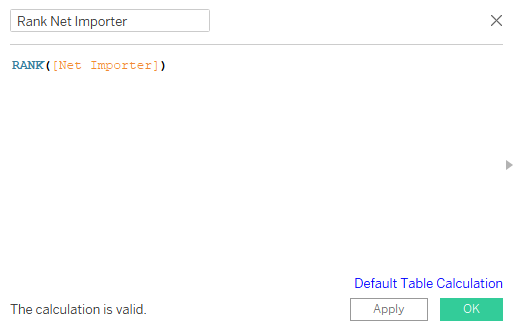{width=250%}<br> <br> 
21 |Under ‘Analysis’, select ‘Create Calculated Field’ to create a new variable called ‘Rank Total Trade’.|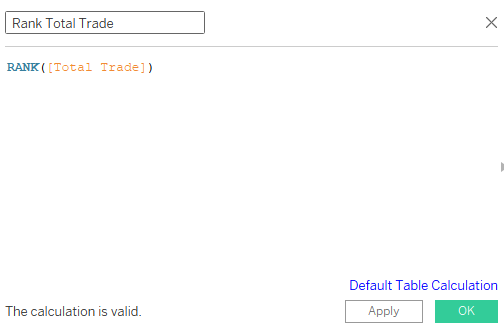{width=250%}<br> <br>  
22 |Under ‘Analysis’, select ‘Create Calculated Field’ to create a new variable called ‘Top Net Exporter’.|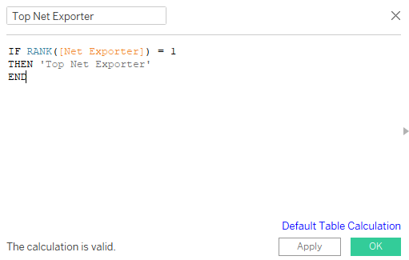{width=250%}<br> <br>   
23 |Under ‘Analysis’, select ‘Create Calculated Field’ to create a new variable called ‘Top Net Importer’.|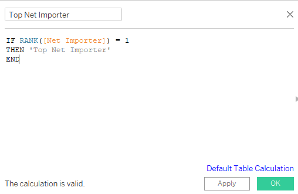{width=250%}<br> <br>   
24 |Add all the variables created in steps 17 – 23 as well as ‘Year’ variable to the detail segment in the Marks card.|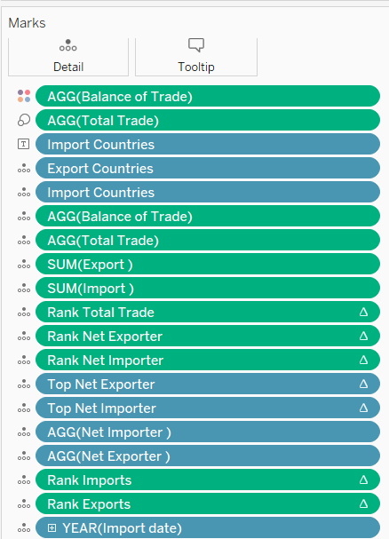{width=250%}<br> <br>  
25 |Create a new worksheet with the title ‘Balance of Trade by Quarter’. <br> <br>Drag ‘Quarter (Import date)’ to the columns shelf and ‘Balance of Trade’ to the rows shelf. <br> <br>Change the chart type to ‘Bar’ under the Marks card.<br> <br>Drag another ‘Quarter (Import date)’ to the columns shelf and ‘Balance of Trade’ to the rows shelf. Change the chart type to ‘Line’ under the Marks card. Change the color of the line graph to orange.|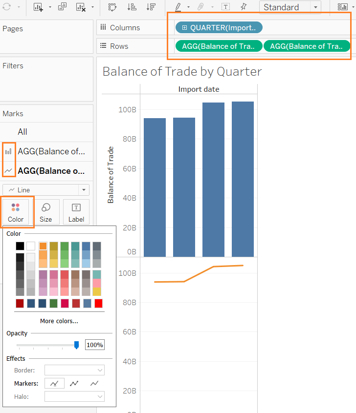{width=250%}<br> <br>  	 
26 |Right click on the y-axis and select ‘Dual Axis’.|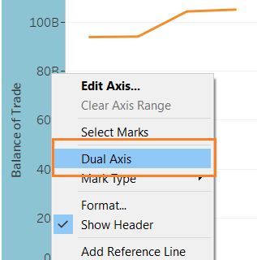{width=250%}<br> <br> 
27 |Right-click on the secondary y-axis and select ‘Synchronise Axis’ and uncheck ‘Show Header’|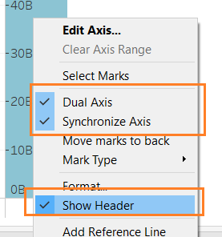{width=250%}<br> <br> 	 
28 |Drag ‘Balance of Trade’ to the color segment in the Marks card. Select red-blue diverging palette with full color range and center at 0.|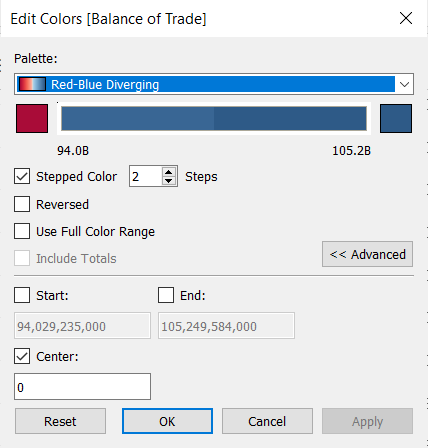{width=250%}<br> <br> 	 
29 |Drag ‘Balance of Trade’ to the label segment in the Marks card. Click on label icon in the Marks card to check for any required adjustments on label formatting.|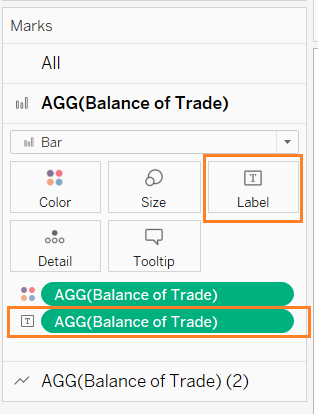{width=250%}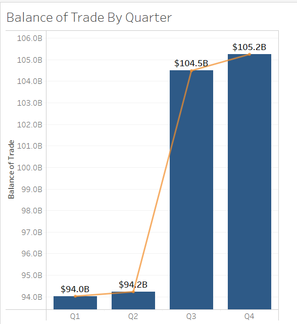{width=250%}<br> <br>  
30 |Create a new worksheet with the title ‘Quarterly total Trade. Drag ‘Quarter(Import date)’ to column shelf and ‘Total Trade’ and ‘Measure Values’ to rows shelf. Keep only ‘Export’ and ‘Import’ variables in ‘Measure values’.|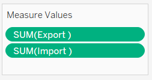{width=250%}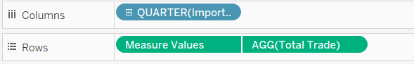{width=250%}<br> <br>   
31 |Add ‘Measure Names’ to color segment in the Marks card. Add ‘Measure Names’ and ‘Measure Values’ to label segment in the Marks card. Click on label icon in the Marks card to check for any required adjustments on label formatting.|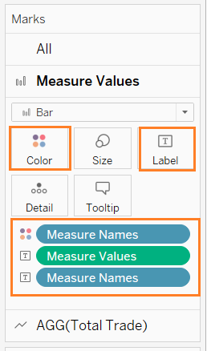{width=250%}<br> <br> 
32 |Edit the tooltip in the ‘Merchandise Trade Value’ worksheet. Insert the worksheets ‘Quarterly Total Trade’ and ‘Balance of Trade by Quarter’ in the tooltip.|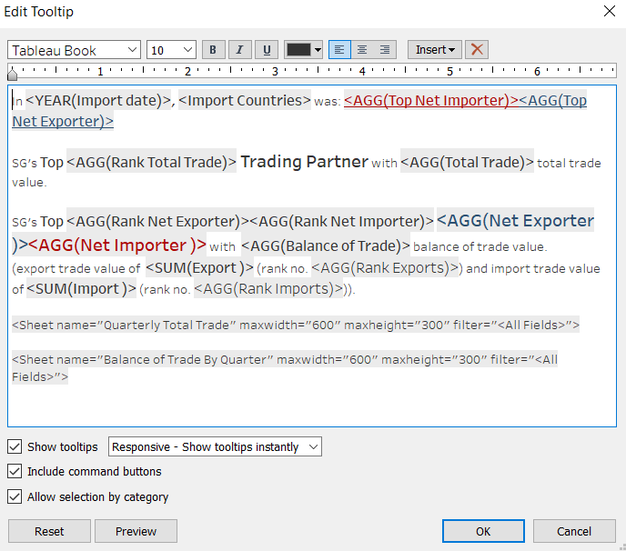{width=250%}<br> <br>  	 
33 |Under the data pane, select create parameter.|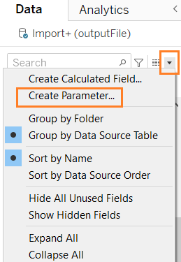{width=250%}<br> <br>  
34 |Create a ‘Top N Total Trade’ parameter with the following properties and range of values.|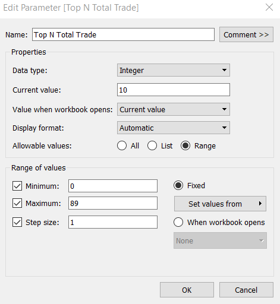{width=250%}<br> <br>   	 
35 |Right click on the import countries variable and select create set. Create a Top N by Total Trade set and select ‘Top N Total Trade’ parameter in the top tab.|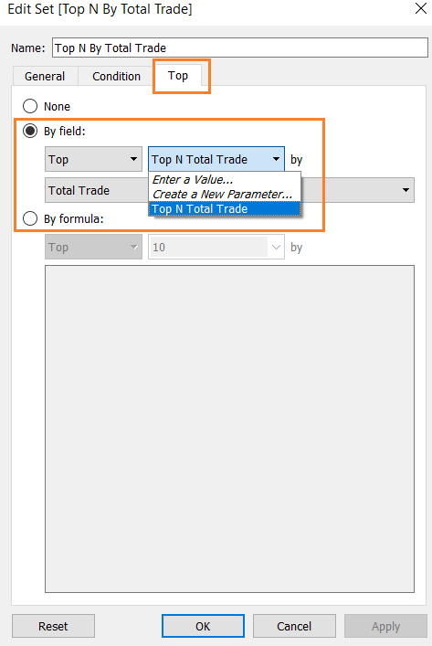{width=250%}<br> <br>  	 
36 |Drag the ‘Top N By Total Trade’ set to the filters card. Right click on the variable in the filter and select ‘edit filter’. Select ‘In’ option in the in/out membership filter.|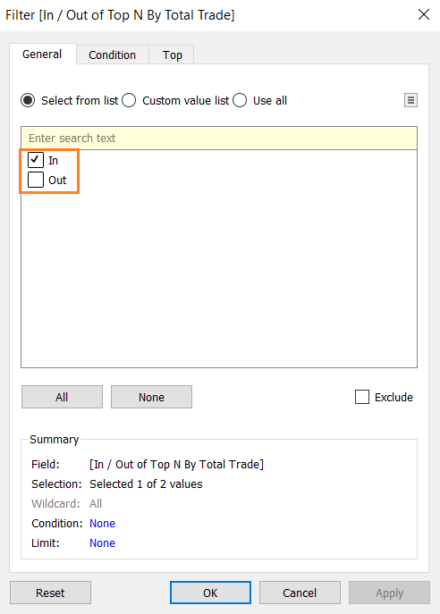{width=250%}<br> <br>   	 
37 |Drag the ‘Year(Import date)’ to the filters card. Right-click on the year filter and select ‘Show Filter’.|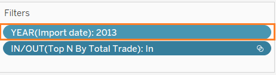{width=250%}<br> <br> 	 
38 |Select single value (list) option for the filter and uncheck show ‘all’ value under the customize option.|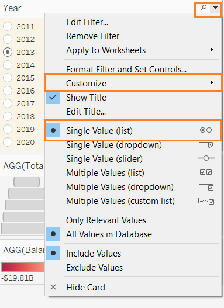{width=250%}<br> <br>  	 
39 |Right click on the ‘Top N by Total Trade’ parameter and select ‘Show Parameter’.|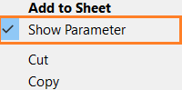{width=250%}<br> <br>  	 
40 |Create a new worksheet titled Balance of Trade, 2011 – 2020. Drag ‘Year(Import Date)’ to columns shelf and repeat steps 26 – 29.|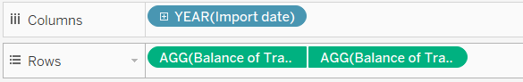{width=250%}<br> <br> 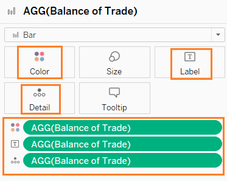{width=250%}<br> <br>   	
41 |Create a new worksheet titled ‘Export and Import by months’.<br> <br> Drag the ‘Month(Import date)’ to column shelf and ‘Export’ and ‘Import’ to rows shelf. <br> <br>Drag Measure Names to color and label segment of Marks card. Select ‘red’ for import and ‘blue’ for export under ‘edit colors’ of color segment.|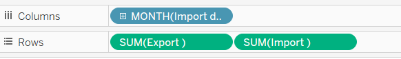{width=250%}<br> <br>|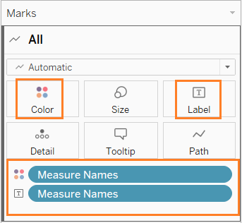{width=250%}<br> <br>  	 
42 |Create a new worksheet titled ‘Quarterly Heat Map – Balance of Trade’.<br> <br> Drag ‘Quarter(Import date)’ to columns shelf.|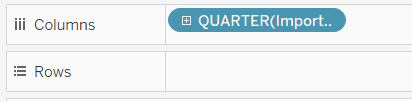{width=250%}<br> <br> 	
43 |Drag ‘Balance’ of Trade to Color segment of Marks card. Edit colors to red-blue diverging with full color range and center at 0.|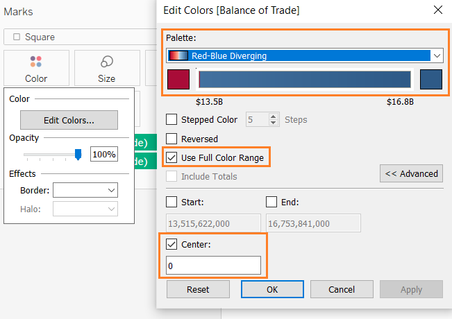{width=250%}<br> <br> 
44 |Drag ‘Balance’ of Trade to Label segment of Marks card.|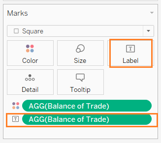{width=250%}<br> <br> 	
45 |Create a new worksheet titled ‘Monthly Heat Map – Balance of Trade’. <br> <br>Drag ‘Quarter(Import date)’ to columns shelf. Thereafter, repeat steps 43 to 44.|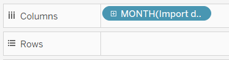{width=250%}<br> <br> 
46 |Edit tooltip to insert ‘Export and Import by months’, ‘Quarterly Heat Map – Balance of Trade’ and ‘Monthly Heat Map – Balance of Trade’ worksheets in ‘Balance of Trade, 2011 – 2020’ worksheet.|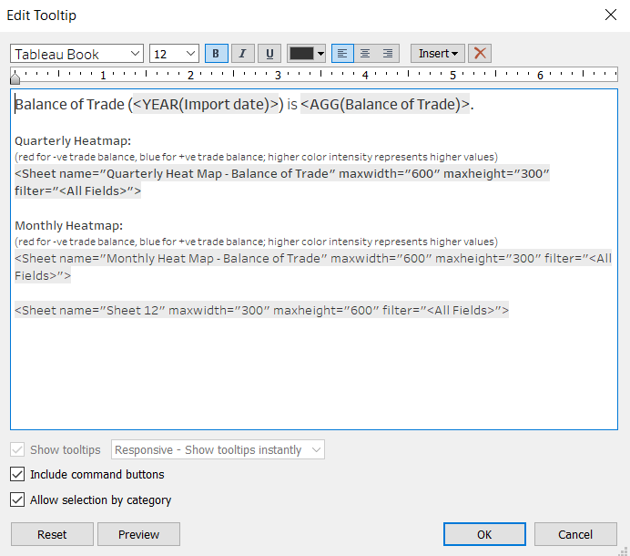{width=250%}<br> <br>	 
47 |Create a new worksheet titled ‘Total Trade, 2011 – 2020’. <br> <br>Drag ‘Year(Import date)’ to columns shelf and ‘Total Trade’ to rows shelf twice and repeat steps 26 to 29.|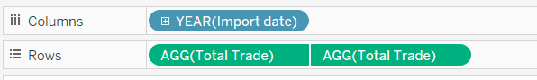{width=250%}<br> <br> 
48 |Drag ‘Total Trade’ to Color segment of Marks card and edit colors, selecting a green palette.|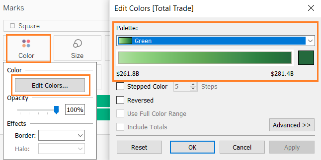{width=250%}<br> <br> 	 
49 |Drag ‘Total Trade’ to label segment of Marks card.|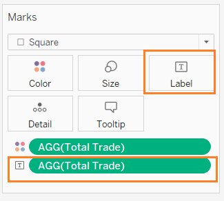{width=250%}<br> <br>
50 |Create a new worksheet titled ‘Quarterly Heat Map – Total Trade’. <br> <br>Drag ‘Quarter(Import Date)’ to columns shelf and ‘Total Trade’ to colors and label segment of Marks card.|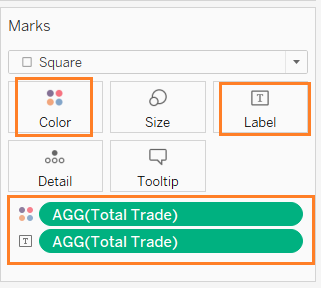{width=250%}<br> <br> 
51 |Create a new worksheet titled ‘Monthly Heat Map – Total Trade’. <br> <br>Drag ‘Month(Import Date)’ to columns shelf and ‘Total Trade’ to colors and label segment of Marks card.|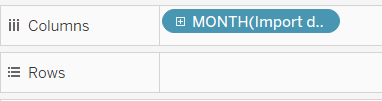{width=250%}<br> <br> 
52 |Edit tooltip to insert ‘Quarterly Heat Map – Total Trade’ and ‘Monthly Heat Map – Total Trade’ worksheets in ‘Total Trade, 2011 – 2020’ worksheet.|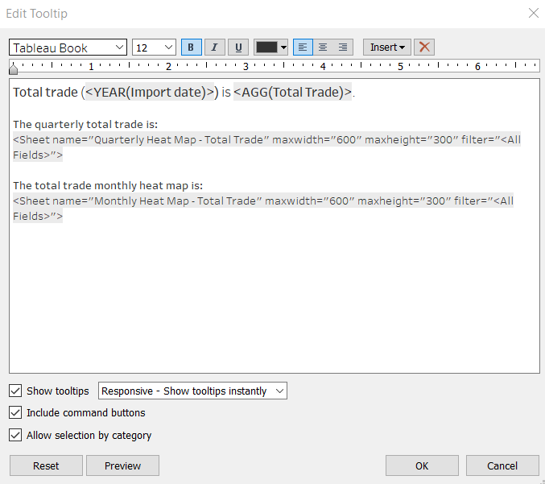{width=250%}<br> <br>	 
53 |Create a new worksheet titled ‘Info’. Create a calculated field ‘i’.|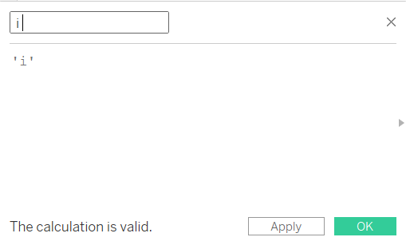{width=250%}<br> <br> 
54 |Drag the ‘i’ pill to Marks card and change the chart type to shape. Select the downloaded info shape palette and click ‘ok’. <br> <br>For more details, Refer to this link on how to add custom shape filters on your dashboard.|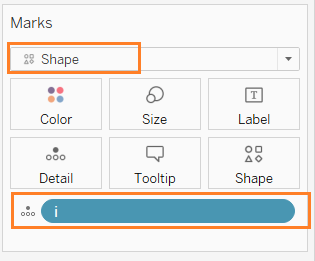{width=250%}<br> <br>
55 |Edit tooltip.|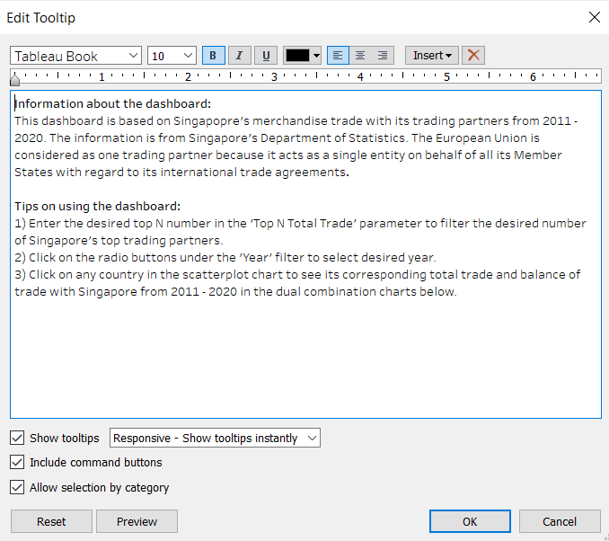{width=250%}<br> <br> 	 
56 |Drag ‘Merchandise Trade Value’ sheet to the top of the dashboard, ‘Total Trade, 2011 – 2020’ sheet to the bottom left of the dashboard and ‘Balance of Trade, 2011 – 2020’ to the bottom right of the dashboard.|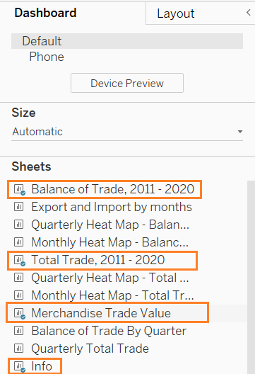{width=250%}<br> <br> 	 
57 |Under ‘Dashboard’, select actions. Click on add action and input the filter action.|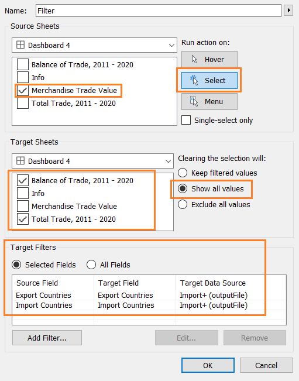{width=250%}<br> <br> 	 		


# 4.Final Visualisation

Please view the proposed visualisation on Tableau Public [**here.**](https://public.tableau.com/app/profile/lim.jin.ru.alethea./viz/DataVizMakeOver2/Dashboard4)


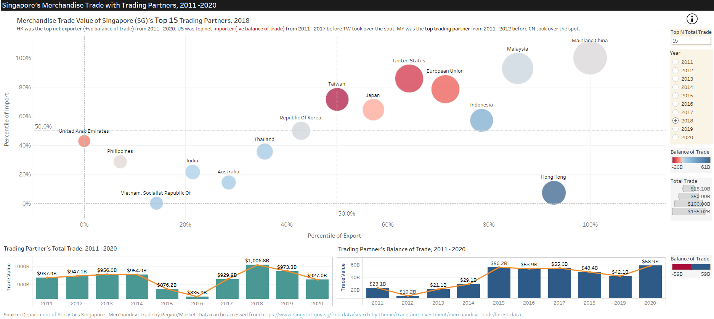{width=150%}

# 5.Major Observations


### The trading performance of our top 3 trading partners in COVID-19 pandemic year, 2020

* **Mainland China** retained its position as top trading partner in 2020. Similar to most of the trading partners, China also had a drop in total trade in 2020 with Singapore as compared to 2019, but the drop is less significant than the top 2 and 3 trading partner, United States and Malaysia. This cushion in total trade value fall in 2020 is bolstered by the strong total trade numbers in Q3 and Q4, especially in Aug, Nov and Dec 2020.  

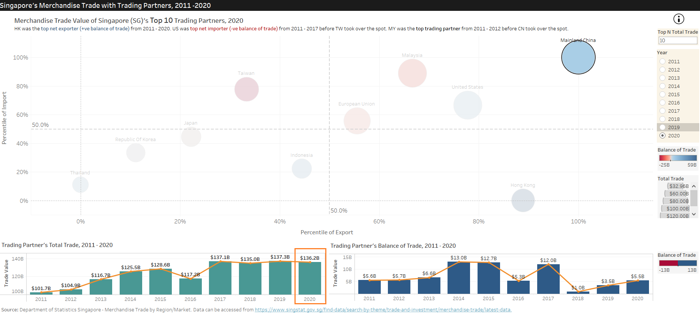

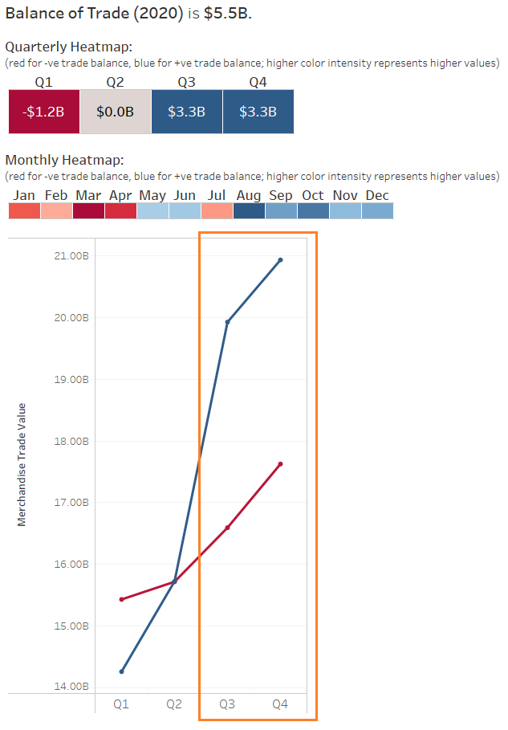{width=70%}

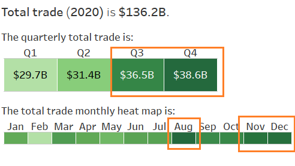{width=70%}


* **Malaysia** retained its position as the second trading partner in 2020 but the gap between United States and Malaysia's total trade has narrowed due to Malaysia's bigger drop in total trade in 2020. In 2020, Malaysia’s Q2 total trade has the greatest drop within the year and this coincided with the lockdown periods for both countries due to COVID-19 control measures (Singapore’s circuit breaker lockdown was from 7 April to 1 June 2020 and Malaysia’s movement control order was from 18 Mar to 3 May 2020 and conditional movement control order from 4 May 2020 to 9 Jun 2020), possibly affecting trade activities. 

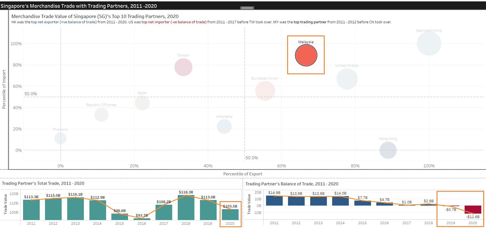

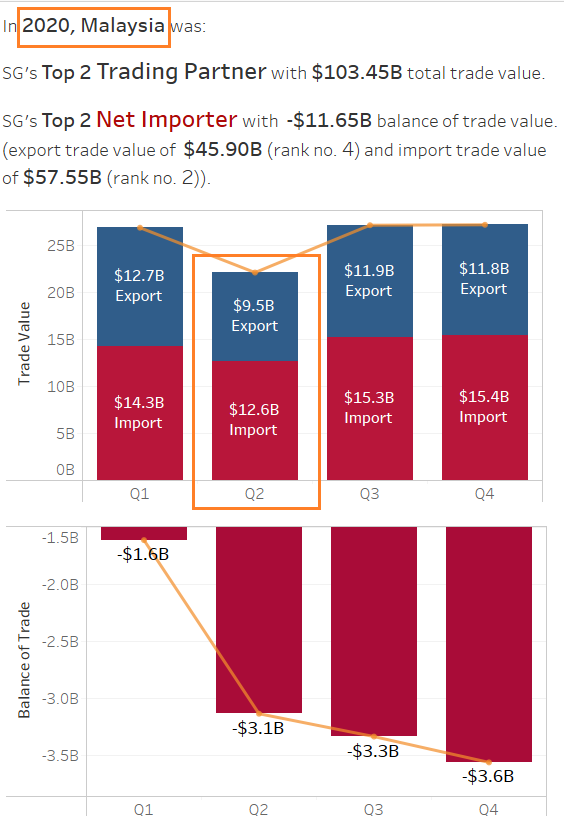{width=70%}

* **United States** had a surprising change from net importer status to a net exporter status in 2020, a drastic change considering that it had been Singapore’s top net importer for the majority of the 2011-2020 period. 

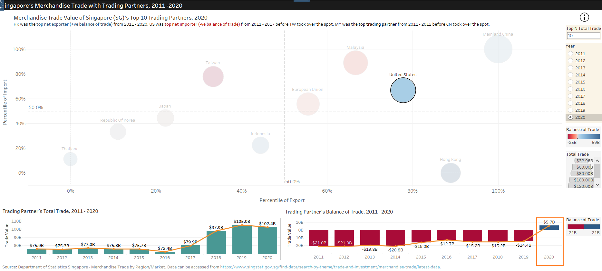
 
This could be due to the impact of COVID-19 on the trading activities between Singapore and the United States. In Q1 2020, United States were still a net importer but by Q2 2020, there was a combination of a sharp drop in imports from United States and a sharp increase in exports to United States, changing United States to Singapore’s net exporter. This trend widened in Q3 2020 with the difference in imports and exports being the widest in July 2020. The fall in total trade in 2020 relative to 2019 was cushioned by a strong Q1, a period before the outbreak wave grew in United States. In Q4 2020, the difference in imports and exports narrowed as compared to Q3 2020 with increasing imports and decreasing exports. 

{width=70%}

### Singapore's Top Trading Partner
* **Malaysia** was the top trading partner from 2011 – 2012 before **China** took over the position from 2013 – 2020. Malaysia maintained its position at rank 2 in terms of total trade with Singapore from 2013 –2020.

Malaysia	| China	
----------------------| ----------------------
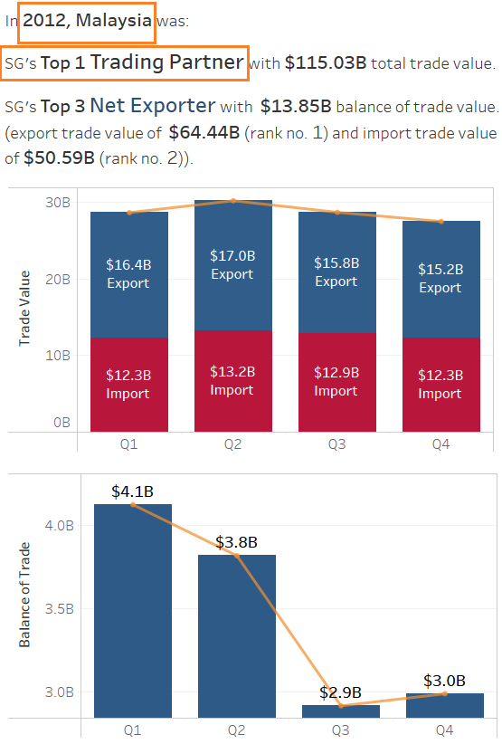{width=80%}|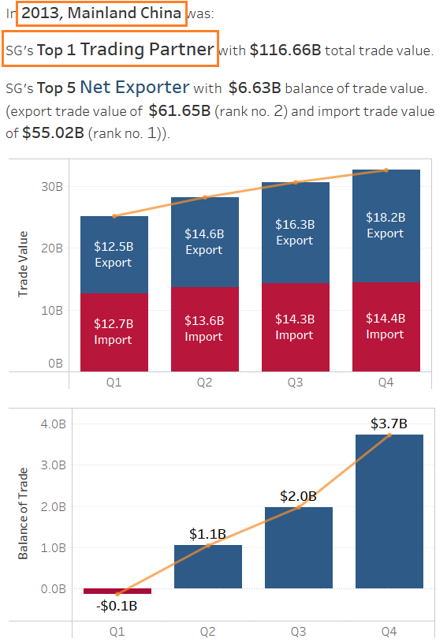{width=80%}
 


### Singapore's Top Net Exporter

* **Hong Kong** has been Singapore’s top net exporter consistently over the last decade from 2011-2020. 
Exports to Hong Kong are several times higher than imports from Hong Kong. Hong Kong’s total trade with Singapore were the highest in 2018, followed by 2017 and 2020. It is interesting to note that there was higher trade in 2020 overall as compared to 2019, bucking the trend of the other countries with falling total trade numbers in the COVID-19 pandemic year. Hong Kong’s total trade with Singapore fell in Q2 2020, more prominently in May 2020, coinciding with Singapore’s COVID-19 circuit breaker period. However, total trade value numbers in 2020 came out stronger than 2019 as there was a strong recovery in Q3 and Q4 2020’s export numbers, surpassing export values for the same quarters in 2019.    	


    


{width=70%}  


2020	| 2019
----------------------| ----------------------
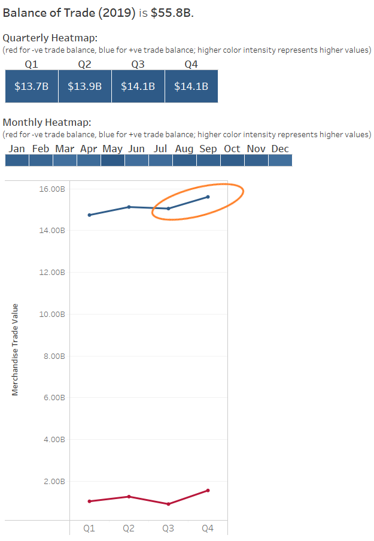{width=95%} |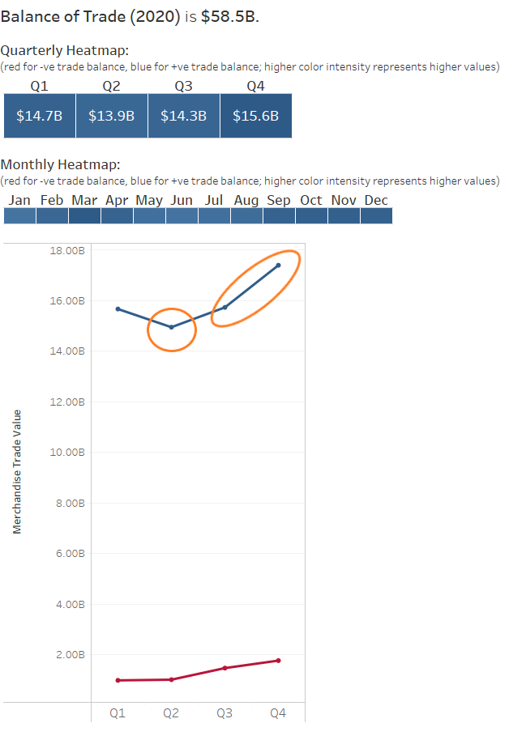{width=95%} 

### Singapore's Top Net Importer

* **United States** has been Singapore’s top net importer from 2011 – 2017 before **Taiwan** took over the position from 2018 – 2020. 

Malaysia	| China	
----------------------| ----------------------
{width=80%}|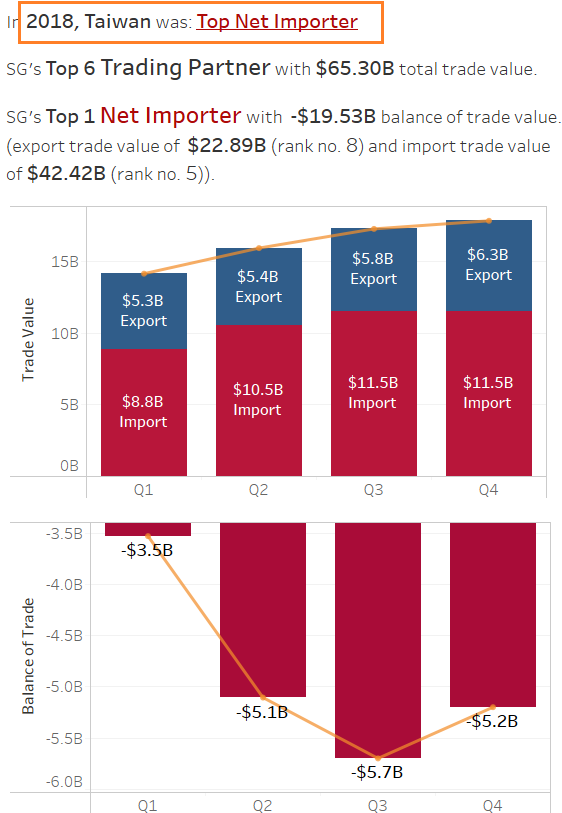{width=80%}
 
Taiwan’s total trade were even higher in 2020 as compared to 2019, bagging the highest total trade value with Singapore in the 2011-2020 period. In 2020, exports to Taiwan fell in Q2, coinciding with Singapore’s circuit breaker period and the rise in COVID-19 cases in Singapore. However, imports from Taiwan rose steadily through all quarters in the year. 

   


### The top 10 trading partners

While the same top 10 trading partners stayed in the top 10 list from 2011 – 2020, most of their rankings has changed at least once in the same period. Some of the countries have changed so much in terms of their ranking that they even move across different quartiles of the import, export scatterplot graph. 

One example is Taiwan. Taiwan ranked number 9 in terms of total trade value with Singapore in 2011 but rose to number 5 in 2019, moving from the bottom left-hand quartile of the graph to the top left-hand quartile of the graph, indicating that Singapore is now importing from Taiwan at a higher-than-average annual total import value as compared to the top 10 trading partners. 

Another example is Indonesia. It fell from being the top 4 trading partner in 2011 to the top 7 trading partner in 2019. Singapore’s export value with Indonesia used to be higher than average as compared to the top 10 trading partners in 2011 (bottom right-hand quartile) but in 2019 (bottom left-hand quartile), Singapore exported a less than average total export value to Indonesia as compared to its top 10 partners. 

Note: 2019 is selected for comparison with 2011 instead of 2020 when observing the relative movement of the countries in this period as 2020 is the COVID-19 pandemic year and there might be some unexpected fluctuations/trading performance in that year. 
 
**2019:**
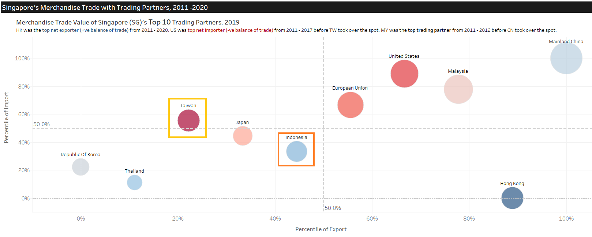

**2011:**
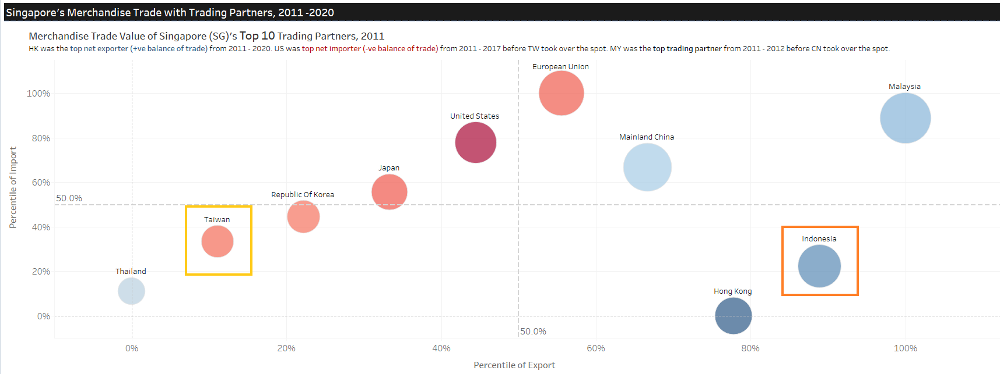
 
 
 
2011	| 2019
----------------------| ----------------------
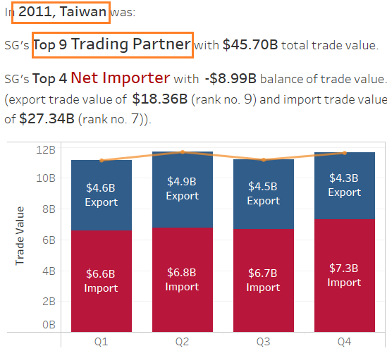{width=95%} |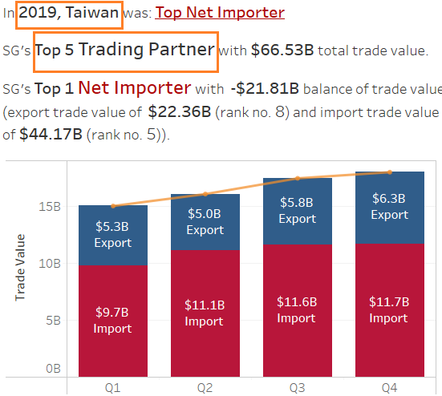{width=95%} 
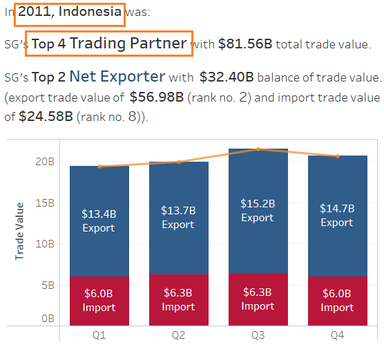{width=95%} |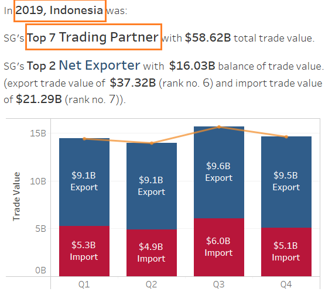{width=95%} 